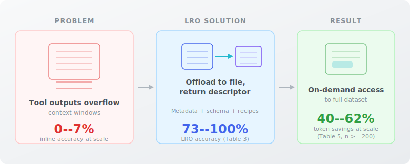

# Large Result Offloading: Demand-Driven Context Management for Tool-Augmented Language Models

[](https://creativecommons.org/licenses/by/4.0/)
[](https://zircote.com/LRO/paper/)
[](https://zircote.com/LRO/paper/specification/)
[]()
[](https://github.com/zircote/LRO/issues)

<picture>
  <source media="(prefers-color-scheme: dark)" srcset=".github/readme-infographic-dark.svg">
  <source media="(prefers-color-scheme: light)" srcset=".github/readme-infographic.svg">
  
</picture>

## About

This repository hosts the open-access paper **"Large Result Offloading: Demand-Driven Context Management for Tool-Augmented Language Models"**, which addresses the challenge of managing large tool outputs within the finite context windows of language models.

**Read the paper online:** [https://zircote.com/LRO](https://zircote.com/LRO)

## Why Open Access

This work is produced by an independent researcher without formal institutional affiliation. By publishing openly on GitHub, the goal is to:

- Make the research freely available to anyone who can benefit from it
- Enable transparent community review and feedback
- Invite collaboration from researchers and practitioners across the field
- Maintain a living document that can evolve with community input

## Repository Structure

| Path | Description |
|------|-------------|
| [`paper/LRO-paper.md`](paper/LRO-paper.md) | Main paper |
| [`paper/specification.md`](paper/specification.md) | Formal specification |
| [`paper/references.md`](paper/references.md) | Bibliography |
| [`CITATION.cff`](CITATION.cff) | Citation metadata |
| [`CONTRIBUTING.md`](CONTRIBUTING.md) | How to contribute |
| [`CODE_OF_CONDUCT.md`](CODE_OF_CONDUCT.md) | Community guidelines |
| [`LICENSE`](LICENSE) | CC BY 4.0 |

## Providing Feedback

Feedback is welcome and encouraged:

- **General feedback**. Use the [Feedback issue template](../../issues/new?template=feedback.yml)
- **Error reports / corrections**. Use the [Errata issue template](../../issues/new?template=errata.yml)
- **Collaboration proposals**. Use the [Collaboration issue template](../../issues/new?template=collaboration.yml)
- **Open discussion**. Visit [GitHub Discussions](../../discussions)

## Citation

If you reference this work, please use the citation metadata provided in [CITATION.cff](CITATION.cff):

```bibtex
@misc{zircote2026lro,
 title = {Large Result Offloading: Demand-Driven Context Management for Tool-Augmented Language Models},
 author = {zircote},
 year = {2026},
 url = {https://zircote.com/LRO}
}
```

## License

This work is licensed under [Creative Commons Attribution 4.0 International (CC BY 4.0)](LICENSE).

You are free to share and adapt this material for any purpose, including commercially, as long as appropriate credit is given.
