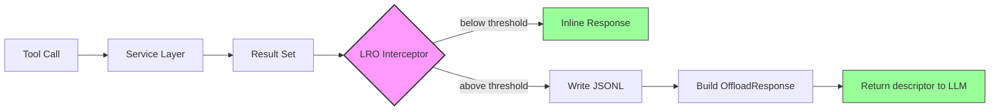
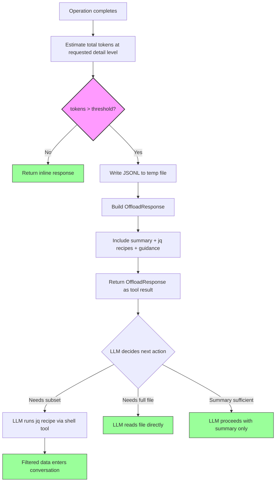
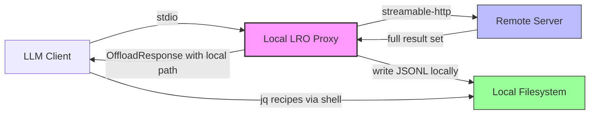
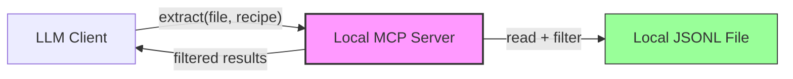

:::note[Living Document]
This specification is a living document under active development. Content will be updated as the protocol design matures.
:::

## Overview

This document provides the formal specification for the Large Result Offloading (LRO) protocol. It is intended as a companion to the [full paper](/LRO/paper/) and serves as the normative reference for implementers.

When MIF operations return large result sets, the full payload consumes significant context window tokens in the AI assistant conversation. Large Result Offloading (LRO) specifies a protocol where results exceeding a token threshold are written to a temporary JSONL file, and the tool returns a compact descriptor with the file path, schema, and ready-to-use `jq` recipes, enabling the assistant to selectively extract only what it needs.

## Motivation

Context windows are finite and expensive. A `recall_memories` call returning 200 memories at `Full` detail can easily exceed 40,000 tokens, consuming half or more of the available context for raw data the assistant will typically filter or summarize. LRO preserves the full result fidelity while returning a compact inline response that guides the assistant to selectively read only the data it needs.

LRO applies to the following MCP tools:

- `recall_memories`
- `inject_context`
- `list_memories`
- Search queries via `SearchService`

> **Scope note:** `list_memories` is available as both an MCP tool and an HTTP API operation (`GET /v1/memories`). LRO applies at the MCP transport layer; HTTP clients SHOULD use the offset-based pagination (`limit` and `offset` parameters) defined in the HTTP API instead.

## Architecture

LRO operates at the **MCP transport layer**, intercepting tool results after the service layer has produced them but before they are serialized into the JSON-RPC response. This keeps the service layer (RecallService, PromptService, SearchService) unaware of offloading.



> **Normative:** The LRO interceptor MUST NOT alter the service layer's return types or interfaces. `PromptIntegration::inject_context` continues to return `Result<String>`. `RecallService::recall` continues to return `Result<Vec<SearchHit>>`. The interceptor operates on the serialized MCP tool response, not on the Rust types.

### Relationship to MCP Tasks

The MCP server spec declares `taskSupport: "optional"` for `recall_memories` and `inject_context`. Tasks handle **long-running execution** (the search itself takes time). LRO handles **large results** (the search completed but the output exceeds the token threshold). These mechanisms compose: a task completes, its result triggers LRO evaluation, and the task result contains the OffloadResponse descriptor if the threshold is exceeded.

### Relationship to Pagination

LRO and Paginated Recall are complementary mechanisms that address the same problem --- large result sets --- through different strategies. When both are available, LRO takes precedence: if the total result set exceeds the offload threshold, the server offloads the full result set to a JSONL file and returns an `OffloadResponse`. Pagination cursors are **not** returned in this case because the agent can access the complete data via the JSONL file.

> **Sequencing:** LRO threshold evaluation occurs on the initial request before any pagination cursor is created. If the LRO interceptor activates, no cursor is created and the server returns an `OffloadResponse`. A result set MUST NOT simultaneously be offloaded to JSONL and have an active pagination cursor.

Pagination applies when:
- LRO is disabled (`prompt.offload.enabled = false`), or
- The result set falls below the LRO threshold.

## Threshold Detection

LRO uses a single global token threshold to decide whether results are returned inline or offloaded to a file.

```rust
/// Global token threshold for LRO activation.
/// Results estimated to exceed this threshold are offloaded to JSONL.
/// Default: 1600 tokens. Configurable via [prompt.offload] config section.
pub const DEFAULT_OFFLOAD_THRESHOLD_TOKENS: usize = 1600;
```

Token estimation MUST use the same heuristic defined in Prompt Integration: `tokens ~ characters / 4` for Latin-script content, with model-specific tokenizers RECOMMENDED for CJK or mixed-script content.

The threshold check occurs **after** the operation completes but **before** formatting the response. Implementations MUST:

1. Execute the operation (recall, search, inject) normally.
2. Estimate the total token count of the result set at the requested detail level.
3. If `estimated_tokens > threshold_tokens`, offload to JSONL and return an `OffloadResponse`.
4. If `estimated_tokens <= threshold_tokens`, return results inline as usual.

> **Normative:** The threshold is evaluated against the **total** result set, not individual memories. A single large memory below the threshold is returned inline; many small memories exceeding the threshold collectively are offloaded.

### Detail Level

The JSONL file MUST serialize memories at the detail level specified in the original tool call. If the caller requests `detail: "light"`, the offloaded file contains Light-detail records. If no detail level is specified, the tool's default applies (`light` for `recall_memories`, `medium` for `inject_context`).

This matters for two reasons:
1. Token estimation accuracy depends on matching the serialization detail level.
2. The jq recipes operate on the fields actually present in the file. Recipes that reference `content` (e.g., recipe #10) will match empty strings at Light detail. The guidance prompt SHOULD note the active detail level so the LLM can adjust its extraction strategy.

## JSONL File Format

Offloaded results are written as line-delimited JSON (JSONL). Each file consists of a header line followed by one MIF memory object per line.

### Header Line (Line 1)

The first line is a metadata header conforming to `OffloadHeader`:

```rust
/// Metadata header written as the first line of an offloaded JSONL file.
#[derive(Debug, Clone, Serialize, Deserialize)]
pub struct OffloadHeader {
    /// Marker identifying this as an LRO header. Always `"lro_header"`.
    #[serde(rename = "type")]
    pub header_type: String,

    /// The operation that produced these results: "recall", "search", "inject", or "list".
    pub operation: String,

    /// The query string (if applicable).
    pub query: Option<String>,

    /// Total number of memory lines following the header.
    pub count: usize,

    /// MIF schema version of the memory objects.
    pub schema_version: String,

    /// ISO 8601 timestamp of when the file was written.
    pub timestamp: String,

    /// Estimated total tokens of the result set.
    pub estimated_tokens: usize,

    /// Detail level used for serialization.
    pub detail: String,
}
```

### Memory Lines (Line 2+)

Each subsequent line is a complete MIF `Memory` object serialized as JSON, including all fields present at the requested detail level:

- Core fields: `id`, `memory_type`, `content`, `created`, `modified`, `namespace`, `title`, `tags`, `status`
- Enrichment fields: `entities`, `relationships`, `wiki_links`, `embedding`, `summary`
- Provenance: `provenance` (confidence, trust_level, source_type, agent)
- Temporal: `temporal` (decay config and state, TTL, valid_from/until)
- Extensions: `extensions`, `blocks`, `citations`

### File Naming

Files MUST be written to a configurable output directory using the following naming convention:

```
{output_dir}/atlatl-{operation}-{ulid}.jsonl
```

Where:
- `{output_dir}` defaults to the system temporary directory (e.g., `/tmp`)
- `{operation}` is the operation name (`recall`, `search`, `inject`, `list`)
- `{ulid}` is a ULID providing both uniqueness and temporal ordering

```rust
/// Represents an offloaded result file.
#[derive(Debug, Clone)]
pub struct OffloadedResult {
    /// Absolute path to the JSONL file.
    pub path: PathBuf,

    /// Header metadata.
    pub header: OffloadHeader,

    /// Time-to-live for this file. After expiry, custodial cleanup MAY delete it.
    pub ttl: Duration,

    /// When this file was created.
    pub created_at: DateTime<Utc>,
}
```

## Inline Response Format

When LRO activates, the tool returns an `OffloadResponse` instead of the full result set. This response is designed as a self-contained prompt that gives the AI assistant everything it needs to work with the offloaded data: a summary for orientation, jq recipes for extraction, and a guidance prompt explaining how to proceed.

The LLM receives this descriptor as the tool result and uses its own capabilities (shell tools, file reading) to act on the referenced file. The MCP server's responsibility ends at producing the descriptor.

```rust
/// Compact response returned when results are offloaded to JSONL.
#[derive(Debug, Clone, Serialize, Deserialize)]
pub struct OffloadResponse {
    /// Indicates this is an offloaded result.
    pub offloaded: bool,

    /// Summary of the result set.
    pub summary: OffloadSummary,

    /// Absolute path to the JSONL file.
    pub file_path: String,

    /// JSON Schema describing each memory line in the JSONL file.
    pub line_schema: serde_json::Value,

    /// Ready-to-use jq recipes for common extraction patterns.
    pub jq_recipes: Vec<JqRecipe>,

    /// Usage guidance for the AI assistant.
    pub guidance: String,
}

#[derive(Debug, Clone, Serialize, Deserialize)]
pub struct OffloadSummary {
    /// Total number of memories in the file.
    pub count: usize,

    /// Estimated total tokens saved by offloading.
    pub estimated_tokens: usize,

    /// The operation that was performed.
    pub operation: String,

    /// Top namespaces represented (up to 5).
    pub top_namespaces: Vec<String>,

    /// Score range (min, max) if applicable.
    pub score_range: Option<(f64, f64)>,

    /// Detail level used for serialization.
    pub detail: String,
}

#[derive(Debug, Clone, Serialize, Deserialize)]
pub struct JqRecipe {
    /// Human-readable description of what this recipe does.
    pub description: String,

    /// The jq command to execute.
    pub command: String,
}
```

### Standard jq Recipe Library

Implementations MUST include exactly 10 recipes in every `OffloadResponse`. Recipes 1-8 are universal and use only Light-level fields. Recipes 9-10 adapt based on the detail level of the offloaded data.

#### Universal Recipes (1-8)

| # | Description | Command |
|---|-------------|---------|
| 1 | List titles with namespaces | `tail -n +2 {file} \| jq -r '[.title, .namespace] \| @tsv'` |
| 2 | Filter by namespace prefix | `tail -n +2 {file} \| jq 'select(.namespace \| startswith("_semantic"))'` |
| 3 | Search titles by keyword | `tail -n +2 {file} \| jq 'select(.title \| test("keyword"; "i"))'` |
| 4 | Extract IDs and titles only | `tail -n +2 {file} \| jq '{id, title, namespace}'` |
| 5 | Filter by memory type | `tail -n +2 {file} \| jq 'select(.memory_type == "semantic")'` |
| 6 | Count by namespace | `tail -n +2 {file} \| jq -s 'group_by(.namespace) \| map({namespace: .[0].namespace, count: length})'` |
| 7 | Filter by tag | `tail -n +2 {file} \| jq 'select(.tags \| index("TAG"))'` |
| 8 | Sort by created date | `tail -n +2 {file} \| jq -s 'sort_by(.created)'` |

#### Detail-Level Adaptive Recipes (9-10)

| # | Light | Medium | Full |
|---|-------|--------|------|
| 9 | List unique namespaces | Sort by confidence desc (`.confidence`) | Sort by confidence desc (`.provenance.confidence`) |
| 10 | Count by memory_type | Full-text search in content (`.content`) | Full-text search in content (`.content`) |

> **Normative:** Recipes MUST only reference fields that exist at the given detail level. Recipes MUST NOT reference `.score` (which is a `SearchHit` field, never serialized into JSONL). At `Full` detail, confidence MUST be accessed via `.provenance.confidence`; at `Medium` detail, via the flattened `.confidence` field.

> **Note:** All recipes use `tail -n +2` to skip the header line. The `{file}` placeholder MUST be replaced with the actual file path from `OffloadResponse.file_path`.

### Guidance Prompt

The `guidance` field MUST contain a brief instruction block for the AI assistant. Implementations SHOULD use the following template:

```
Results offloaded to JSONL ({count} memories, ~{tokens} tokens saved).
File: {path}
Detail level: {detail}

Use the jq recipes above to extract specific data. Common patterns:
- Browse: recipe #1 (titles with namespaces)
- Filter: recipe #2 (by namespace) or #3 (by keyword)
- Analyze: recipe #8 (count by namespace)

Read the file directly only if you need the complete dataset.
The header line (line 1) contains metadata; memory objects start at line 2.
```

## Integration with inject_context

The `inject_context` MCP tool composes `RecallService` and `PromptIntegration` to produce formatted context for prompt injection. LRO interacts with this pipeline as follows:

1. The service layer executes normally: `RecallService::recall` returns scored memories, `PromptIntegration::inject_context` formats them into a string under the token budget.
2. The LRO interceptor evaluates the **pre-budget result set** (the full set of memories returned by recall, before token budgeting trims them).
3. If the pre-budget result set exceeds the LRO threshold, the interceptor offloads the full result set and returns an OffloadResponse. The formatted string from `PromptIntegration` is discarded.
4. If the pre-budget result set is below the LRO threshold, the formatted string from `PromptIntegration` is returned inline as usual.

> **Rationale:** LRO intercepts before budgeting because token budgeting already handles the "too large for context" problem by truncating. If LRO waited until after budgeting, the result would always be under the context limit and LRO would never trigger. The value of LRO for `inject_context` is preserving access to the *full* result set (including memories that budgeting would have dropped) while keeping the inline response compact.

## Decision Flow



## Cleanup and Lifecycle

Offloaded JSONL files are ephemeral and MUST be cleaned up after their TTL expires.

### TTL

- Default TTL: 3600 seconds (1 hour)
- Configurable via `prompt.offload.ttl_seconds`
- Implementations MUST record `created_at` for each offloaded file

### Custodial Integration

Implementations SHOULD register an `offload_cleanup` custodial task that:

1. Scans the `output_dir` for files matching `atlatl-*.jsonl`
2. Deletes files whose `created_at + ttl` has elapsed
3. Emits `OffloadFileExpired` events for observability

| Task Name | Default Schedule | Description |
|-----------|-----------------|-------------|
| `offload_cleanup` | Every hour | Delete expired LRO JSONL files |

### Error Handling

If the temporary file write fails (disk full, permission denied, etc.), implementations MUST fall back to returning an inline truncated result:

1. Truncate the result set to fit within `threshold_tokens`.
2. Include a warning in the response indicating that LRO failed and results are truncated.
3. Emit an `OffloadWriteFailed` event with the error details.

Implementations MUST NOT fail the entire operation due to an LRO write failure. The offloading is an optimization; the operation itself succeeded.

## Configuration

LRO configuration lives under the `[prompt.offload]` section:

```toml
[prompt.offload]
enabled = true                          # Enable/disable LRO globally
threshold_tokens = 1600                 # Token threshold for offloading
ttl_seconds = 3600                      # File TTL (1 hour default)
output_dir = ""                         # Empty = system temp dir
```

| Key | Type | Default | Description |
|-----|------|---------|-------------|
| `prompt.offload.enabled` | `bool` | `true` | Enable or disable LRO |
| `prompt.offload.threshold_tokens` | `u32` | `1600` | Token threshold for activation |
| `prompt.offload.ttl_seconds` | `u64` | `3600` | Seconds before file cleanup |
| `prompt.offload.output_dir` | `String` | `""` (system temp) | Directory for JSONL files |

Environment variable mapping follows the standard convention:

| Config Key | Environment Variable |
|-----------|---------------------|
| `prompt.offload.enabled` | `ATLATL_PROMPT__OFFLOAD__ENABLED` |
| `prompt.offload.threshold_tokens` | `ATLATL_PROMPT__OFFLOAD__THRESHOLD_TOKENS` |
| `prompt.offload.ttl_seconds` | `ATLATL_PROMPT__OFFLOAD__TTL_SECONDS` |
| `prompt.offload.output_dir` | `ATLATL_PROMPT__OFFLOAD__OUTPUT_DIR` |

## Known Constraints

LRO is designed for the primary deployment model: a local MCP server connected via stdio to an LLM client with shell tool access. Two deployment configurations fall outside this model.

### Remote Transport (streamable-http)

When the MCP server runs remotely via streamable-http, the JSONL file resides on the server's filesystem. The `file_path` in the OffloadResponse points to a location the LLM client cannot reach, and the jq recipes reference a file that is not locally accessible.

**Resolution:** A Remote Transport Proxy resolves this constraint. When a proxy client connects to a remote server, the remote server detects `clientInfo.proxy: true` and returns full results inline (bypassing its own LRO). The local proxy then applies its own LRO interceptor, writing JSONL files to the local filesystem where the LLM's shell tools can access them.

For deployments **without** a proxy, the original constraint still applies: streamable-http transport SHOULD disable LRO (`prompt.offload.enabled = false`) unless the client and server share a filesystem (e.g., network-mounted storage). When LRO is disabled, the standard inline response path applies: results are returned directly in the tool response, subject to the MCP tool's `limit` parameter and token budgeting.

### Local LRO Proxy for Remote Servers

Implementations MAY provide a lightweight local MCP server (via stdio transport) whose sole responsibility is materializing LRO files on the local filesystem on behalf of a remote HTTP-based server. This pattern enables a centralized memory system --- where all memory storage, search, and enrichment run on a shared remote server --- while preserving the local file access that LRO's jq-based extraction workflow requires.



The local LRO proxy operates as follows:

1. The proxy connects to the remote server via streamable-http and registers itself as a proxy client (`clientInfo.proxy: true`).
2. The remote server, detecting the proxy flag, returns full inline results (bypassing its own LRO interceptor).
3. The local proxy applies its own LRO interceptor to the received results, writing JSONL files to the local filesystem using the standard JSONL File Format and File Naming conventions.
4. The proxy returns an `OffloadResponse` to the LLM client with `file_path` pointing to the local JSONL file.
5. The LLM client executes jq recipes against the local file using its shell tools.

> **Normative:** A local LRO proxy MUST implement threshold detection and JSONL materialization as defined in this specification. The proxy MUST NOT alter the memory data received from the remote server; it acts as a transparent pass-through with local file materialization. Custodial cleanup of locally materialized files follows the same TTL and cleanup rules defined in Cleanup and Lifecycle.

This architecture separates concerns cleanly: the remote server owns the memory store, search indices, and enrichment pipeline; the local proxy owns only the ephemeral JSONL files needed for the current session's LRO extractions. The proxy requires no persistent state and MAY be started and stopped with the LLM client session.

> **Implementation note:** The local LRO proxy MAY be bundled as a standalone binary, a plugin for existing MCP client frameworks, or a sidecar process. It requires only stdio transport support (to face the LLM client) and HTTP client capability (to reach the remote server). No memory storage, search, or enrichment logic is needed in the proxy.

### Native Extraction via MCP Tools

A local LRO proxy (or any stdio-based MCP server with access to the offloaded file storage) MAY expose extraction operations as native MCP tools, eliminating the need for the LLM client to invoke shell commands and `jq` directly. In this model, the proxy reads and filters the JSONL file internally and returns the extracted subset as a tool result, keeping the LLM's interaction entirely within the MCP tool protocol.



An implementation MAY provide an `lro_extract` tool (or equivalent) with the following semantics:

| Parameter | Type | Description |
|-----------|------|-------------|
| `file_path` | `string` | Path to the offloaded JSONL file (from `OffloadResponse.file_path`) |
| `recipe` | `integer \| null` | Standard recipe number (1-10) to execute. Mutually exclusive with `query`. |
| `query` | `string \| null` | A jq filter expression for custom extraction. Mutually exclusive with `recipe`. |
| `params` | `object \| null` | Substitution parameters for parameterized recipes (e.g., `{"namespace": "_semantic", "keyword": "caching", "tag": "architecture"}`). |

The tool:

1. Reads the JSONL file from local storage, skipping the header line.
2. Applies the requested recipe or custom jq filter against the memory lines.
3. Returns the filtered result set as the tool response.

> **Normative:** The `jq_recipes` array MUST still be included in the `OffloadResponse` for interoperability with clients that prefer shell-based extraction.

#### Native Guidance Prompt

When an implementation provides native extraction, the tool MUST generate its own `guidance` prompt that directs the LLM to the extraction MCP tool rather than to shell-based jq commands. Implementations SHOULD use the following template:

```
Results offloaded to JSONL ({count} memories, ~{tokens} tokens saved).
Detail level: {detail}

Use the `lro_extract` tool to query this result set. Examples:
- Browse: lro_extract(file_path="{path}", recipe=1)
- Filter by namespace: lro_extract(file_path="{path}", recipe=2, params={"namespace": "_semantic"})
- Search by keyword: lro_extract(file_path="{path}", recipe=3, params={"keyword": "your term"})
- Custom filter: lro_extract(file_path="{path}", query="select(.confidence > 0.8)")

Available recipes: 1=titles+namespaces, 2=filter namespace, 3=search titles,
4=IDs+titles, 5=filter type, 6=count by namespace, 7=filter tag, 8=sort by date,
9=detail-adaptive, 10=detail-adaptive.
```

> **Normative:** The guidance prompt is generated by the tool itself --- the implementation that provides `lro_extract` owns the prompt content. This ensures the guidance accurately reflects the tool's actual parameter interface, available recipes, and any implementation-specific extensions.

Because the guidance is self-describing, the LLM discovers the extraction capability at the moment it receives an offloaded result. No MCP initialization handshake or capability negotiation is required beyond the tool being listed in the server's tool manifest.

#### Advantages

- **No shell dependency.** The LLM does not need access to `bash`, `jq`, or `tail`. This extends LRO's utility to shell-less clients.
- **Reduced tool-call overhead.** A single MCP tool call replaces the multi-step sequence of formulating a shell command, executing it, and parsing the output.
- **Sandboxed execution.** The extraction runs within the MCP server process with controlled file access, rather than in an unrestricted shell environment.
- **Recipe parameterization.** The `params` object allows the LLM to parameterize standard recipes without string interpolation in shell commands, eliminating a class of injection errors.
- **Self-contained prompt.** The tool generates its own guidance, so prompt content stays in sync with the tool's interface.

> **Implementation note:** The native extraction tool is fully compatible with the local LRO proxy architecture. A proxy that materializes JSONL files locally already has filesystem access and can trivially add an extraction tool.

### Shell-less LLM Clients

Some LLM clients (web-based chat interfaces, mobile applications) do not provide shell or file-reading tools to the model. In these environments, the LLM receives the OffloadResponse but cannot execute jq recipes or read the file.

The OffloadResponse remains partially useful without shell access. The `summary` field provides the result count, top namespaces, score range, and detail level. The LLM can use this metadata to answer high-level questions about the result set or to inform the user that detailed results are available in the offloaded file.

Implementations MAY detect the client's tool capabilities during MCP initialization and adjust behavior:

- If the client declares no tool-use capability beyond the server's own tools, the server MAY increase the LRO threshold or disable LRO to favor inline results.
- The server MUST NOT assume the client has shell access. The guidance prompt uses advisory language ("Use the jq recipes above") rather than imperative language, so an LLM without shell tools can gracefully skip the extraction step without producing an error.

## Conformance Requirements

| Conformance Level | Requirement |
|-------------------|-------------|
| Level 1 | MAY implement LRO. If implemented, MUST support threshold detection and JSONL output. |
| Level 2 | SHOULD implement LRO. If implemented, MUST include the standard jq recipe library and custodial cleanup. |
| Level 3 | MUST implement LRO with threshold detection, JSONL output, full jq recipe library, custodial cleanup, and error fallback. |
